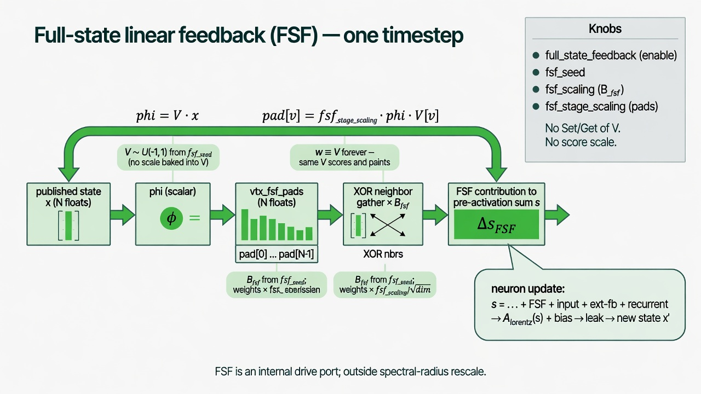

# Full-state linear feedback — theory and landed API

> Status: **landed (mechanism)**.  
> Internal drive port: form a single channel value **φ = V · x**, then inject it
> **exactly like external feedback with one channel** (fill `vtx_fsf_` with φ,
> XOR-gather × **B_fsf**). Config on `ReservoirConfig` / `ESN`. Details in
> [Reservoir.md](Reservoir.md).

## Design (canonical)

```
Construction (fsf_seed, standalone — not reservoir.seed):
  V[i]   ~ U(-1, 1)                         // first N draws; φ only
  B_fsf  ~ U(-1, 1) * fsf_scaling / √dim    // next N·dim draws

Each Step:
  φ = fsf_stage_scaling * (V · x)           // V used only here
  vtx_fsf_[0 .. N) = φ                      // same scalar on every vertex (ext-fb D=1)
  UpdateState: s += vtx_fsf_[neighbor] * B_fsf[v,i]
```

| Piece | Role |
|--------|------|
| **V** | Only builds φ |
| **φ** | Single-channel drive this step |
| **`vtx_fsf_`** | Staged field (all entries φ) |
| **B_fsf** | Inject weights (same gather form as external feedback) |
| **`fsf_stage_scaling`** | Scale on the channel φ |
| **`fsf_scaling`** | Scale baked into B_fsf at construction |

No Set/Get of V. `Create(GetConfig())` rebuilds V and B_fsf from seed + scales.

## Code sketch

```cpp
ESNConfig cfg;
cfg.reservoir.full_state_feedback = true;
cfg.reservoir.fsf_seed            = 1;
cfg.reservoir.fsf_scaling         = 0.5f;
cfg.reservoir.fsf_stage_scaling   = 1.0f;
ESN esn(cfg);
// FSF applies inside ReservoirStep / Warmup / Run automatically
```

## Drive-port map

```
  input              — InjectInput → vtx_input_ → gather B_in
  external feedback  — InjectExternalFeedback → vtx_ext → gather B_ext
  FSF                — φ = V·x → fill vtx_fsf_ with φ → gather B_fsf
```



## Reference

Ehlers, P. J., Nurdin, H. I., & Soh, D. *Improving the Performance of Echo State
Networks Through Feedback*. arXiv:2312.15141.

---

## Appendix: FSF for Dummies

**Make one number, inject like external feedback.**

1. **φ = V · x** — only use of V (full-state score).  
2. **Write φ into every entry of `vtx_fsf_`** — same as one external-feedback channel.  
3. **Gather** in `UpdateState`:

```cpp
s += vtx_fsf_[v ^ NearestMask(i)] * fsw[i];  // fsw = B_fsf row for vertex v
```

Staging does **not** multiply by weights; the **B_fsf** multiply is in the gather
(same as input / external feedback).

### One-line summary

**V** → φ; **φ** fills **`vtx_fsf_`**; **B_fsf** injects. Same mechanism as
single-channel external feedback; only the source of the scalar differs.
