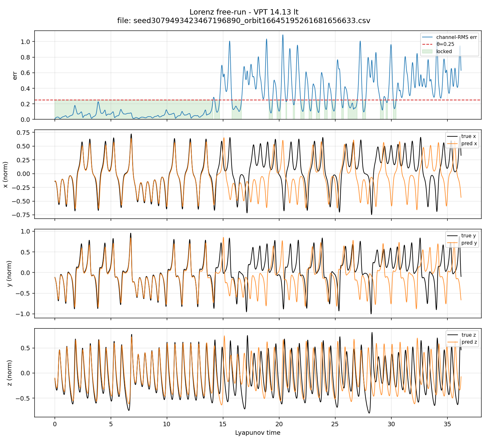
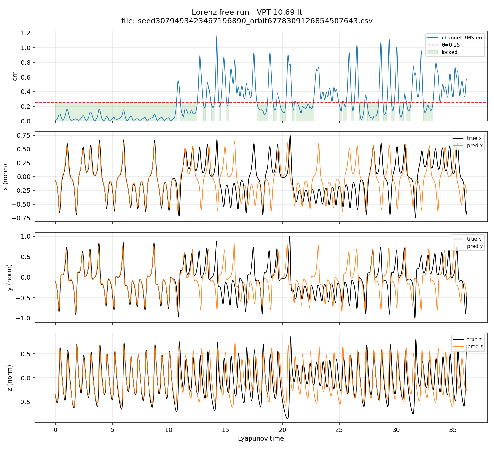
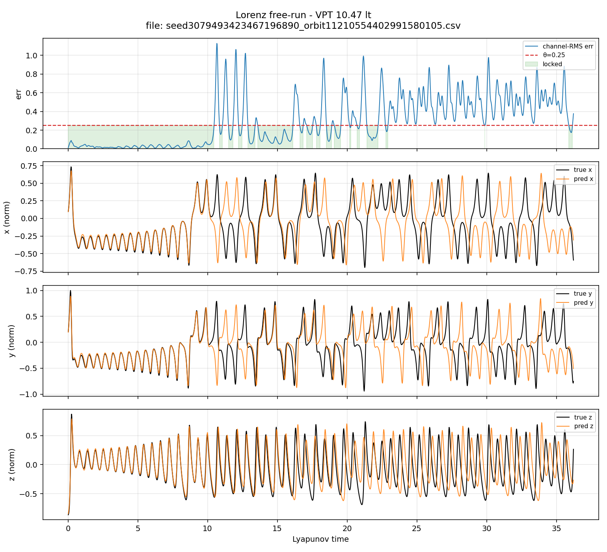
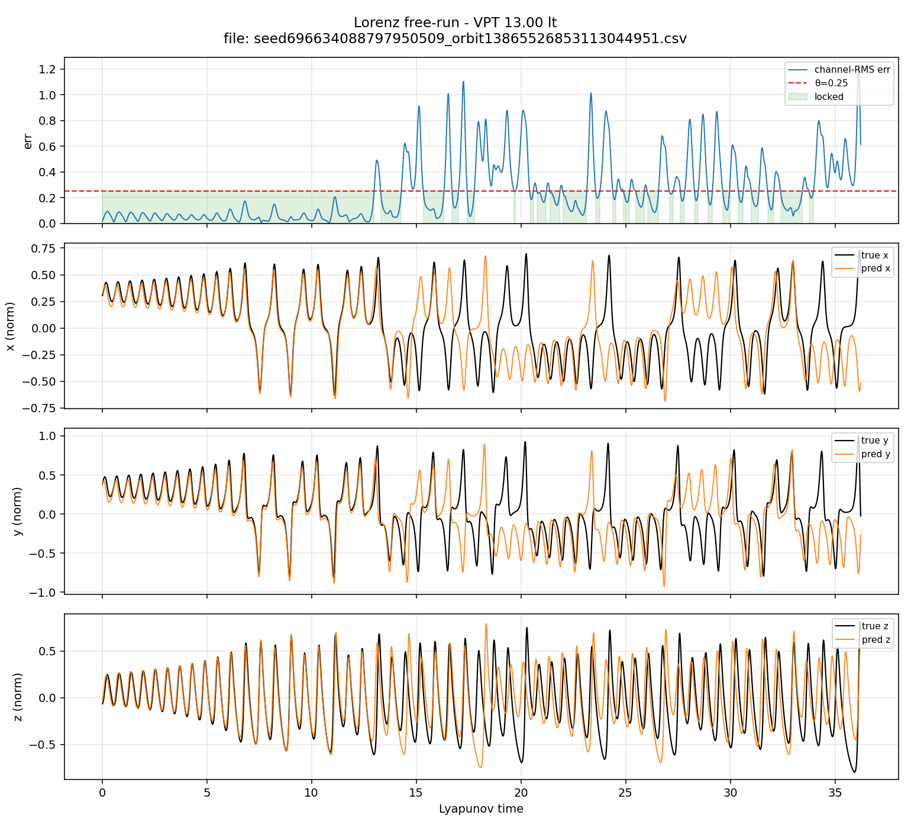
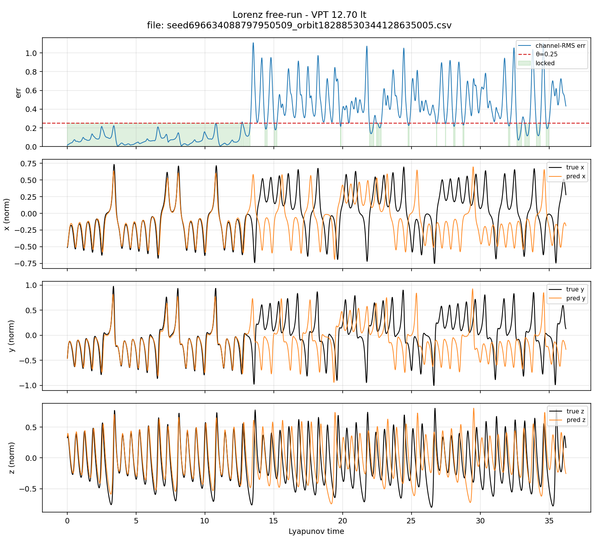
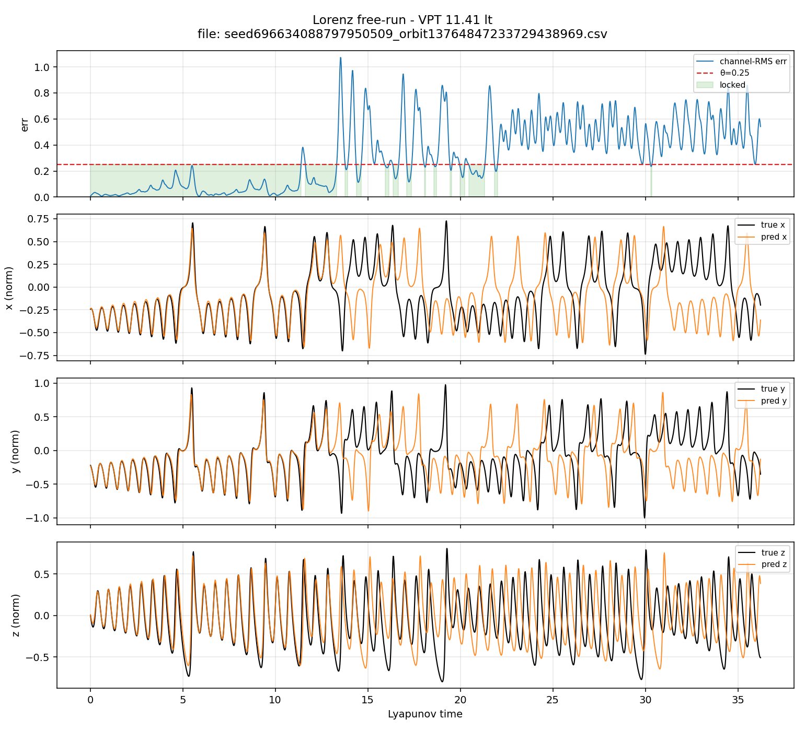
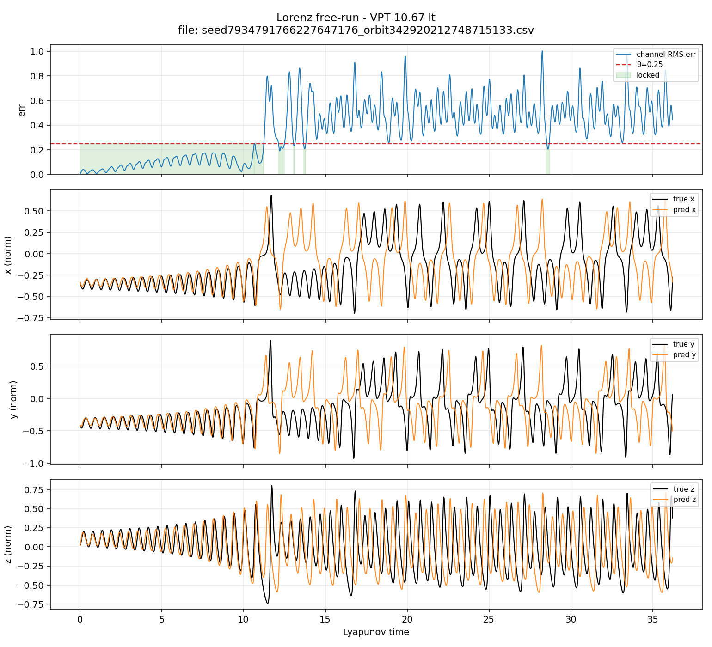
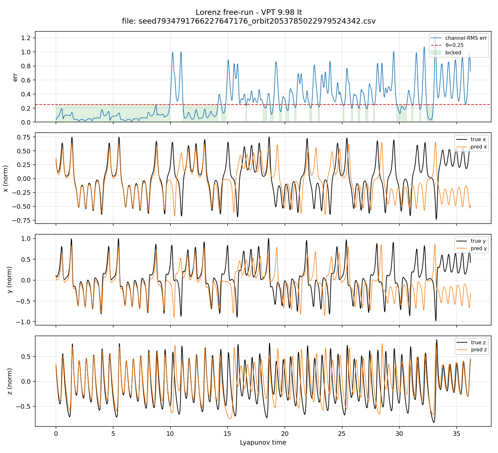
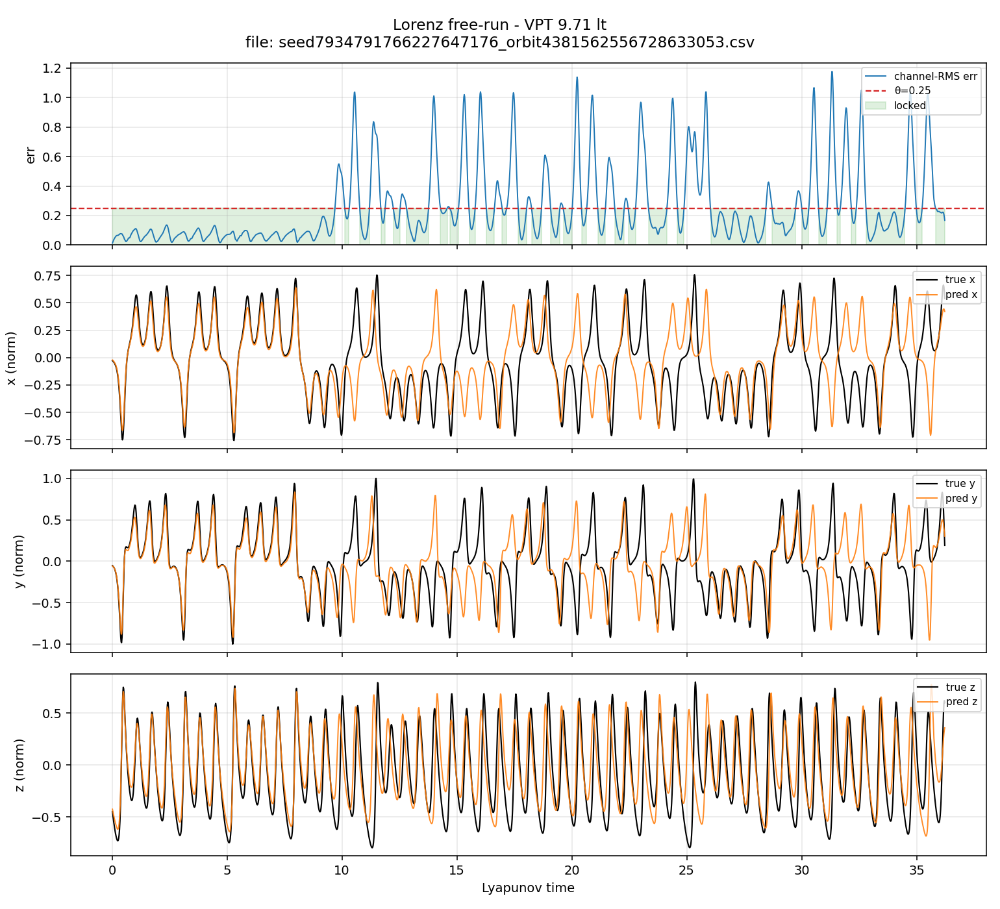

# Lorenz — free-run on Lorenz-63

Closed-loop free-run: train a HypercubeESN online on a Lorenz-63 orbit, then
generate with self-feedback on the **input bank** (predicted `[x, y, z, x*z]`
re-injected as the next drive; external feedback off). VPT uses θ = 0.25.

Half-anchored **Janus** dual-cursor free-run was explored and dropped for this
product example; reference archive:
[`Research Topics/Lorenz_JanusCursor/`](../../Research%20Topics/Lorenz_JanusCursor/).

---

## 1. Literature context — vanilla ESN free-run on Lorenz-63

Ballpark for **vanilla Echo State Network** free-run on Lorenz-63,
scored versus Lyapunov time. Unassisted closed loop after teacher-forced
training. Do not quote these ranges as HypercubeESN results until the example
survey is re-run with the same free-run seating.

| Class | Valid prediction horizon (Lyapunov times) |
|-------|-------------------------------------------|
| Conventional / baseline ESNs | **~4–8 LT** |
| Well-tuned (N = 100–500, careful SR / scaling) | **~10–15 LT** |
| Extreme optimized / noiseless claims | **>30 LT** (definition- and solver-sensitive) |

**Papers:** [Doan et al.](https://arxiv.org/abs/1906.11122) · [Hurley et al.](https://arxiv.org/abs/2508.06730) · local PDFs under [`reference/`](reference/)

---

## 2. Pipeline

The example trains a HypercubeESN on Lorenz-63, then free-runs it closed-loop
by feeding its own predictions back as input.

**Orbit.** An RK4 integrator builds one Lorenz-63 trajectory (σ, ρ, β, and `dt`
as configured). That series is normalized into roughly `[-1, 1]` and walked by a
cursor: a train window first, then a free-run runway used only for scoring.

**What the network sees.** Four inputs at every step: `x`, `y`, `z`, and the
product `x*z`. During training and warmup those come from the true orbit.
During free-run they come from the network’s last prediction (`x*z` is rebuilt
from the predicted `x` and `z`). The readout targets are the three state
components `(x, y, z)`.

**Model.** A fixed hypercube reservoir plus an online-trained HCNN readout.
External feedback is off — closed-loop coupling is only through the input bank.

**Train.** Multi-epoch teacher forcing: predict the current state, update the
readout, inject the true drive, and advance (horizon-1 / prequential).

**Free-run.** Warm up on true data at the end of the train section, then
generate: predict → pack as the next drive → step the reservoir. Score against
the held-out orbit (VPT, duty, RMSE, and related lock proxies).

---

## 3. Results

Top 10 free-run orbits by VPT (valid prediction time, Lyapunov times), per ESN seed.

### esn_seed = 3079493423467196890

| Rank | orbit_seed           | VPT     | duty   |
|-----:|---------------------:|--------:|-------:|
|    1 | 16645195261681656633 | 14.1274 | 0.5515 |
|    2 |  6778309126854507643 | 10.6861 | 0.5775 |
|    3 | 11210554402991580105 | 10.4687 | 0.4890 |
|    4 |  9079883845812469805 | 10.1971 | 0.4720 |
|    5 |   377028733301268385 | 10.0522 | 0.3970 |
|    6 |   342920212748715133 | 10.0159 | 0.4810 |
|    7 | 18237947595775874669 |  9.8529 | 0.4635 |
|    8 |    13422544920716770 |  9.8348 | 0.4600 |
|    9 |  5025719928104590317 |  9.7805 | 0.4795 |
|   10 |  9283244478090866364 |  9.5812 | 0.3835 |

### esn_seed = 696634088797950509

| Rank | orbit_seed           | VPT     | duty   |
|-----:|---------------------:|--------:|-------:|
|    1 | 13865526853113044951 | 13.0044 | 0.6320 |
|    2 | 18288530344128635005 | 12.6965 | 0.4450 |
|    3 | 13764847233729438969 | 11.4106 | 0.4430 |
|    4 |  9776693947267941955 | 11.1932 | 0.6030 |
|    5 |  3176892907321841240 | 10.9034 | 0.4955 |
|    6 |  6662435693939472323 | 10.3963 | 0.4710 |
|    7 | 13585281107395895665 | 10.3238 | 0.5135 |
|    8 |  4286656764774219017 | 10.2333 | 0.4500 |
|    9 |  2870944243156974091 | 10.0703 | 0.4325 |
|   10 | 10966813110498538719 |  9.5088 | 0.5150 |

### esn_seed = 7934791766227647176

| Rank | orbit_seed           | VPT     | duty   |
|-----:|---------------------:|--------:|-------:|
|    1 |   342920212748715133 | 10.6680 | 0.3290 |
|    2 |  2053785022979524342 |  9.9797 | 0.4850 |
|    3 |  4381562556728633053 |  9.7080 | 0.6680 |
|    4 | 13485130503103931780 |  9.5994 | 0.5865 |
|    5 |  4258066496804509840 |  9.5269 | 0.4755 |
|    6 | 17906519568822214812 |  9.4907 | 0.4350 |
|    7 |  7730991648230479828 |  9.4907 | 0.4060 |
|    8 |  3171901337486448293 |  9.4545 | 0.3985 |
|    9 |   837812888794294026 |  9.4182 | 0.5425 |
|   10 | 18122106123368409551 |  9.1466 | 0.5215 |

### Free-run overlays (top 3 by VPT)

PNG traces from [`surveys/`](surveys/) — one free-run per orbit (true vs predicted).

#### esn_seed = 3079493423467196890

**Rank 1** — orbit `16645195261681656633`, VPT 14.1274

**Rank 2** — orbit `6778309126854507643`, VPT 10.6861

**Rank 3** — orbit `11210554402991580105`, VPT 10.4687

#### esn_seed = 696634088797950509

**Rank 1** — orbit `13865526853113044951`, VPT 13.0044

**Rank 2** — orbit `18288530344128635005`, VPT 12.6965

**Rank 3** — orbit `13764847233729438969`, VPT 11.4106

#### esn_seed = 7934791766227647176

**Rank 1** — orbit `342920212748715133`, VPT 10.6680

**Rank 2** — orbit `2053785022979524342`, VPT 9.9797

**Rank 3** — orbit `4381562556728633053`, VPT 9.7080

